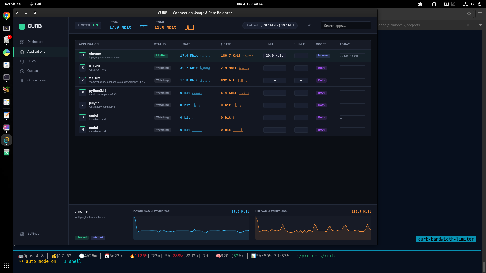

# CURB

**C**onnection **U**sage & **R**ate **B**alancer — NetLimiter-style, per-application
bandwidth monitoring and control for Linux.

CURB lets you watch and limit network bandwidth **per application**, live, with
separate inbound/outbound controls, host-wide caps, LAN-vs-internet scoping, and
data quotas. It ships as a CLI (`curb`) and a dark-themed desktop GUI.

> Status: early development. See [the build plan](#roadmap) for what works today.

## Architecture

| Component | Crate / dir | Role |
|-----------|-------------|------|
| Contract  | `proto/` (`curb-proto`) | The frozen IPC wire protocol + client library shared by every component. |
| Engine    | `curbd/` | Privileged daemon. Owns the control socket and (from P2) the eBPF/tc/cgroup traffic engine. |
| CLI       | `cli/` (`curb`) | Command-line client. |
| GUI       | `gui/` *(later)* | Tauri app: Rust backend = thin client of `curbd`; web frontend = the UI. |

The daemon runs privileged (systemd service) and listens on a Unix socket
(`/run/curbd.sock`, mode `0660`, group `curb`). The CLI and GUI are unprivileged
clients of that socket.

## Build

```sh
cargo build            # builds curb-proto, curbd, curb
```

Requirements for the engine (later phases): Linux kernel ≥ 5.10 with BTF
(`/sys/kernel/btf/vmlinux`), cgroup v2, and `CAP_NET_ADMIN`/`CAP_BPF`.

## Try it (P0)

Run the daemon and talk to it over a dev socket (no root needed):

```sh
CURB_SOCK=/tmp/curbd.sock cargo run -p curbd            # terminal 1
CURB_SOCK=/tmp/curbd.sock cargo run -p curb -- ping     # terminal 2
CURB_SOCK=/tmp/curbd.sock cargo run -p curb -- status
```

## GUI

A dark-themed Tauri desktop app lives in `gui/`. Its Rust backend
(`gui/src-tauri`) is a thin client of `curbd` over the same control socket; the
frontend polls live traffic and drives the limit/quota controls.

```sh
cd gui/src-tauri && cargo build      # needs Tauri's Linux deps (see below)
# run against a daemon (set CURB_SOCK to match the running curbd):
CURB_SOCK=/run/curbd.sock ./target/debug/gui
```

Build deps (Debian/Ubuntu): `pkg-config libwebkit2gtk-4.1-dev libgtk-3-dev
librsvg2-dev libsoup-3.0-dev libjavascriptcoregtk-4.1-dev`.



## Roadmap

- **P0 — Scaffold** ✅ workspace, IPC contract, daemon + CLI skeletons, `ping`/`status`.
- **P1 — Live monitoring** ✅ AF_PACKET capture + `/proc` per-app attribution, `curb top`.
- **P2 — Host-wide limits** ✅ tc HTB + IFB; live on/off and rate changes; in/out split.
- **P3 — Per-app limits** ✅ cgroup v2 + nftables `socket cgroupv2` policing.
- **P4 — LAN vs Internet** ✅ per-rule scope matching.
- **P5 — Quotas** ✅ per-app accounting + block-on-exceed + persistence.
- **P6 — GUI** ✅ live dark-themed Tauri app wired to the daemon.

### eBPF shaping

Per-app **upload** is shaped smoothly via an eBPF egress classifier + HTB
(queuing, not dropping). Per-app **download** defaults to nftables policing.

Smooth eBPF **download** shaping (clsact ingress set-priority + `mirred` redirect
to an IFB device + HTB) is implemented but **off by default** — enable it with:

```sh
CURB_EBPF_INGRESS=1 curbd
```

> ⚠️ The download path redirects all ingress through an IFB device. It is
> validated end-to-end in an isolated network namespace
> (`scripts/netns_daemon_test.sh`) — run that to verify on your kernel before
> enabling on a real interface. An earlier `bpf_redirect`-based attempt
> blackholed inbound traffic; the shipped path uses the reinjection-correct
> `mirred` redirect instead.

### Future
- proc-connector exec hook to place processes in their cgroup before they
  connect (catch already-established connections).
- Host-wide LAN/Internet scoping; per-app live graphs history; system tray.

## License

MIT
